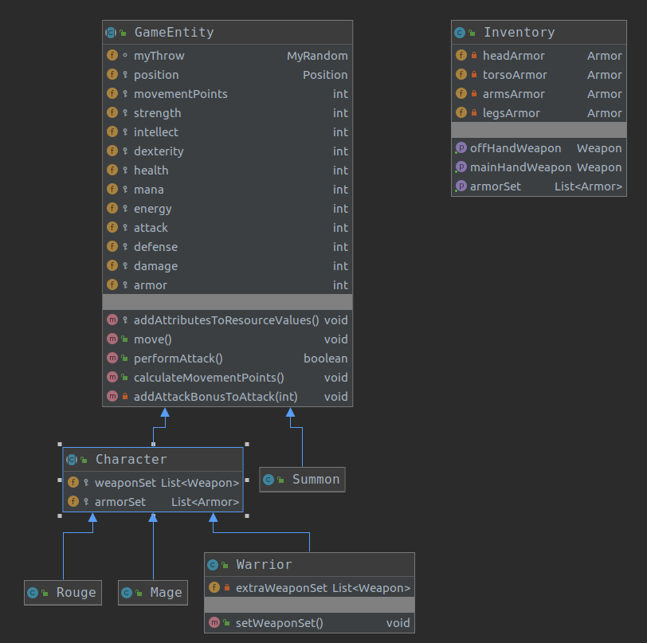
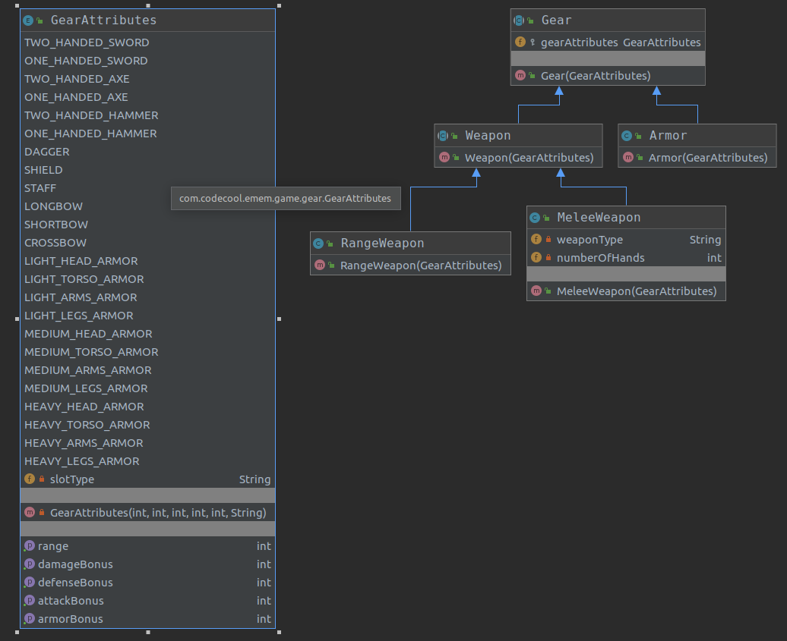

# LordArenaJava

This project has been created for practicing OOP in Java. 
This is a structure for a role-playing-game in a boardgame style. 
It's a heavy project, a long-term plan for me to finish it one day. 

In this state of the project, there is only the base structure of the game:  

  
  

  
# technologies

This project has been written in Java11.
